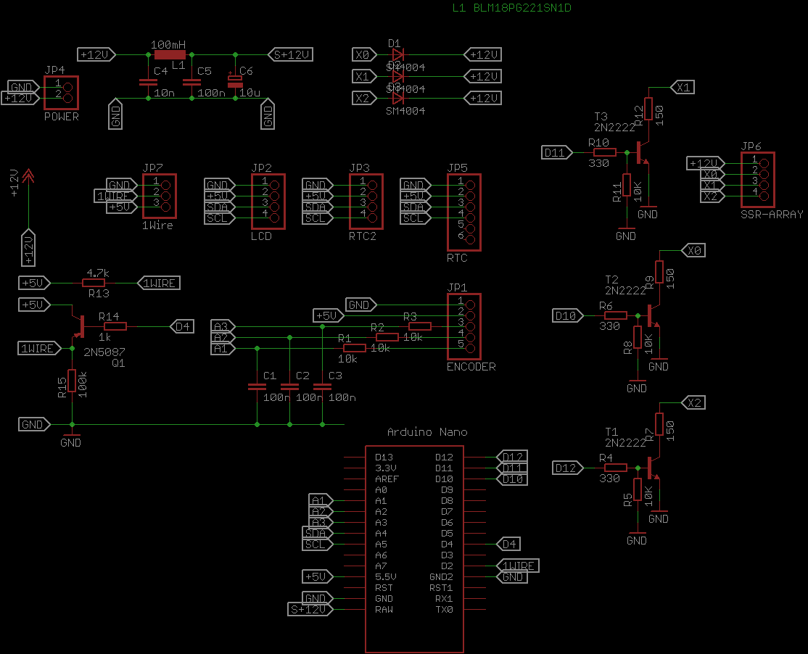

# 3phase boiler controller project
Arduino based control unit circuit and firmware

# WARNING!!!  This code was created for my own test and study purposes and finally was implemented in DIY project for three phase 360V heater.
# DISCLAIMER! Any reproducing of the unit and usage it with high voltage devices is at your own risk!

History of project: 
I had cheap 12kW (360V) water heater in home climate system which had a problem with contactor frequently and I replaced it few times per season. 
To avoid this issue I decide include Solid State Relays with digital thermostat to heater circuit (serial connection to contactor based termostat for better safety).
This solution replaced mechanical switching with spark which destroy contactor to semiconductor switching and algorithm in thermostat reduced switches of heater to possible minimum.
I decide create my own thermostat circuit using Arduino nano as module to which i can connect LCD, Encoder, Sensors and SSR (or magnetic relay for other appliances). 

Required units:

Arduino Nano, 
Encoder unit KY-040 (with 3 10k resistors on board), 
LCD 1602 with I2C adaptor, 
SSR Fotek SSR-40DA 3 pcs, 
DS18B20 thermal sensor with holder module 

List of all semiconductor components is included in Eagle project. 

